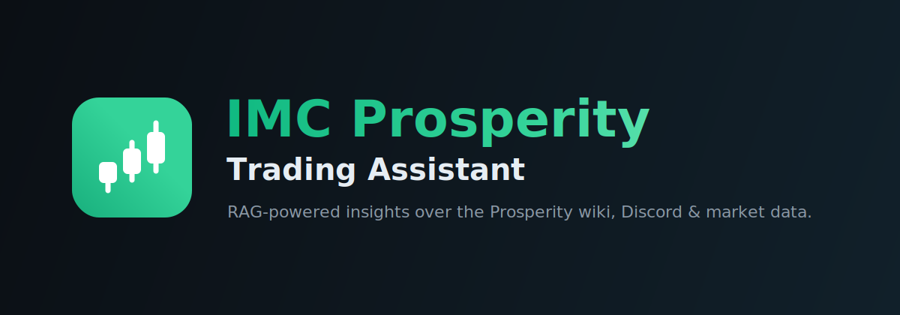
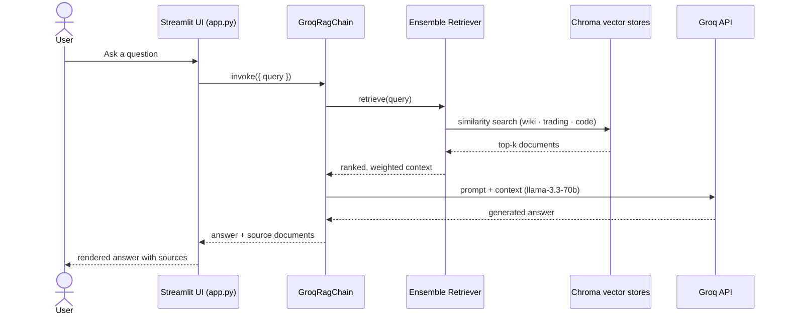

<p align="center">
  <picture>
    <source media="(prefers-color-scheme: dark)" srcset="assets/banner-dark.svg">
    <source media="(prefers-color-scheme: light)" srcset="assets/banner-light.svg">
    
  </picture>
</p>

[](https://github.com/Builder106/IMC_Prosperity/actions/workflows/ci.yml)
[](https://www.python.org/)
[](#license)
[](https://tradetell.streamlit.app)
[](https://streamlit.io)

An AI assistant for the **IMC Prosperity** trading competition: ask about products,
position limits, and strategies — or request a ready-to-run trading algorithm —
and get answers grounded in the competition wiki, community Discord, and historical
market data via retrieval-augmented generation.

**Live app:** [tradetell.streamlit.app](https://tradetell.streamlit.app)

## Overview

This project combines Notion wiki content, trading logs, and code examples into a
RAG (Retrieval-Augmented Generation) system that can:

- Answer questions about IMC Prosperity rules, mechanics, and concepts
- Analyze trading logs and surface insights
- Help develop and improve trading algorithms (it generates complete `Trader` classes)
- Retrieve relevant market data and code examples for grounding

## Features

- **Streamlit chat interface** — conversational UI with history, per-answer sources, and example prompts
- **RAG system** — ensemble retrieval over three weighted vector stores (wiki, trading data, code)
- **Groq-backed generation** — fast inference via the Groq API (`llama-3.3-70b-versatile` by default)
- **Knowledge base** — Notion wiki (Markdown), Discord exports, and processed trading data
- **Trading log analysis** — summarizes and extracts insights from competition logs

## How it works



The vector stores are built in-memory at startup (cached for the session), so the
first query after a cold start re-embeds the corpus and is slower than the rest.

## Project structure

- **`app.py`** — Streamlit application entry point (chat UI + RAG wiring)
- **`src/`** — source code
  - **`rag/`** — RAG system
    - **`build_rag_system.py`** — document processing, vector stores, retriever, chain
    - **`groq_llm.py`** — `GroqRagChain` (Groq-backed, swappable backend)
    - **`model_config.py`** — env-driven model/embedding configuration
    - **`process_raw_trading_data.py`** — trading-data processing
  - **`algorithms/`** — round-by-round trading algorithms
  - **`utils/`** — Notion scraper and trading-log tools
- **`data/`** — `prosperity_wiki/` (Markdown), `trading_data/`, processed datasets
- **`tests/`** — pytest suite (offline; network mocked)

## Getting started

### Prerequisites

- Python 3.9+
- Required packages (`pip install -r requirements.txt`)
- A Groq API key ([console.groq.com/keys](https://console.groq.com/keys))

### Installation

```bash
git clone https://github.com/Builder106/IMC_Prosperity.git
cd IMC_Prosperity
python -m venv .venv && source .venv/bin/activate
pip install -r requirements.txt
```

Create a `.env` in the project root with your Groq API key:

```
GROQ_API_KEY=your_groq_api_key_here
```

Optional overrides (defaults shown):

```
LLM_MODEL=llama-3.3-70b-versatile
LLM_TEMPERATURE=0.2
GROQ_TIMEOUT_SECONDS=180
EMBEDDING_MODEL=sentence-transformers/all-MiniLM-L6-v2
```

When deploying on Streamlit Community Cloud, add the same keys under
**Manage app → Settings → Secrets** instead of a `.env` file.

### Running

```bash
streamlit run app.py
```

## Usage

1. Ask a question about products, position limits, or strategies — or request a trading algorithm.
2. Read the AI-generated answer; expand **sources** to see the retrieved context.
3. Use the sidebar example prompts as starting points.

### Working with trading logs

```bash
python src/utils/summarize_trading_logs.py
```

Follow the prompts to input a log file path and receive a detailed summary.

## Development

See [CONTRIBUTING.md](CONTRIBUTING.md) for setup, test commands, and project
guardrails. Run the suite with:

```bash
pytest
```

## Acknowledgments

- IMC Prosperity for the trading competition
- LangChain for the RAG framework
- Groq for fast LLM inference
- Streamlit for the web interface

## License

Released under the [MIT License](LICENSE).
