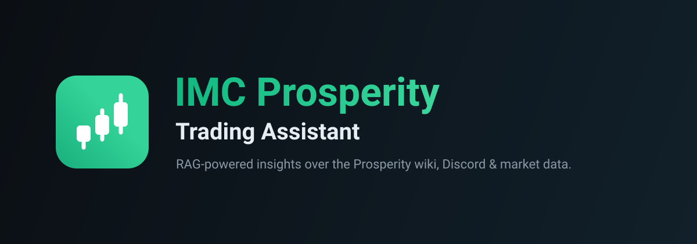
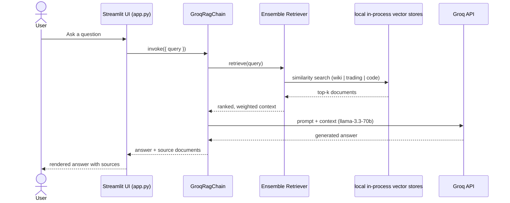

<p align="center">
  <picture>
    <source media="(prefers-color-scheme: dark)" srcset="assets/banner-dark.svg">
    <source media="(prefers-color-scheme: light)" srcset="assets/banner-light.svg">
    
  </picture>
</p>

[](https://github.com/Builder106/imc-prosperity/actions/workflows/ci.yml)
[](https://www.python.org/)
[](#license)
[](https://tradetell.streamlit.app)
[](https://streamlit.io)

> **An AI assistant for competitive algorithmic trading.** Turns rules, market data, and community knowledge into automated trading bots.

## 💡 What is this Assistant?

In algorithmic trading competitions, participants write code that buys and sells assets automatically in simulated markets. This assistant acts like a trading coach and strategy generator. It reads competition rulebooks, historical trade data, and community discussions to answer technical questions and generate working trading algorithms.

Ask about products, position limits, and market mechanics, or request a ready-to-run trading algorithm grounded in competition rules via search-augmented AI (RAG).

**Live app:** [tradetell.streamlit.app](https://tradetell.streamlit.app)

## 🛠 Technical Overview

This project combines documentation wikis, trading logs, and code examples into an AI search system that can:

- Answer questions about IMC Prosperity rules, mechanics, and market concepts
- Analyze trading logs and highlight key performance insights
- Help develop and improve trading algorithms by generating complete Python trading classes
- Retrieve relevant historical market data and verified code examples to back up its answers

## Features

- **Interactive chat interface**: Conversational web UI with chat history, verified source documents, and example prompts
- **Multi-source search**: Searches across three in-process knowledge stores (rules wiki, historical trading data, and code examples)
- **Fast cloud inference**: Powered by the Groq API (`llama-3.3-70b-versatile` by default)
- **Comprehensive knowledge base**: Includes competition guides, community discussions, and processed market datasets
- **Trading log analyzer**: Summarizes and extracts actionable insights from competition logs

## How it works


```mermaid
sequenceDiagram
    actor User
    participant UI as Streamlit UI (app.py)
    participant RAG as GroqRagChain
    participant R as Ensemble Retriever
    participant VS as local in-process vector stores
    participant Groq as Groq API
    User->>UI: Ask a question
    UI->>RAG: invoke({ query })
    RAG->>R: retrieve(query)
    R->>VS: similarity search (wiki | trading | code)
    VS-->>R: top-k documents
    R-->>RAG: ranked, weighted context
    RAG->>Groq: prompt + context (llama-3.3-70b)
    Groq-->>RAG: generated answer
    RAG-->>UI: answer + source documents
    UI-->>User: rendered answer with sources
```

The vector stores are built in memory at startup. Streamlit caches the assembled
retriever for the session, but a cold start still processes and embeds the
corpus as needed.

## Project structure

- **`app.py`**: Streamlit application entry point (chat UI + RAG wiring)
- **`src/`**: source code
  - **`rag/`**: RAG system
    - **`build_rag_system.py`**: document processing, vector stores, retriever, chain
    - **`groq_llm.py`**: `GroqRagChain` (Groq-backed, swappable backend)
    - **`model_config.py`**: env-driven model/embedding configuration
    - **`process_raw_trading_data.py`**: trading-data processing
  - **`algorithms/`**: round-by-round trading algorithms
  - **`utils/`**: Notion scraper and trading-log tools
- **`data/`**: `prosperity_wiki/` (Markdown), `trading_data/`, processed datasets
- **`tests/`**: pytest suite (offline; network mocked)

## Getting started

### Prerequisites

- Python 3.11+
- Installed dependencies (`uv sync --group dev`)
- A Groq API key ([console.groq.com/keys](https://console.groq.com/keys))

### Installation

```bash
git clone https://github.com/Builder106/imc-prosperity.git
cd IMC_Prosperity
uv sync --group dev
```

Create a `.env` in the project root with your Groq API key:

```bash
GROQ_API_KEY=your_groq_api_key_here
```

Optional overrides (defaults shown):

```bash
LLM_MODEL=llama-3.3-70b-versatile
LLM_TEMPERATURE=0.2
GROQ_TIMEOUT_SECONDS=180
EMBEDDING_MODEL=sentence-transformers/all-MiniLM-L6-v2
```

When deploying on Streamlit Community Cloud, add the same keys under
**Manage app → Settings → Secrets** instead of a `.env` file.

### Running

```bash
streamlit run app.py
```

## Usage

1. Ask a question about products, position limits, or strategies, or request a trading algorithm.
2. Read the AI-generated answer; expand **sources** to see the retrieved context.
3. Use the sidebar example prompts as starting points.

### Working with trading logs

```bash
python src/utils/summarize_trading_logs.py
```

Follow the prompts to input a log file path and receive a detailed summary.

## Development

See [CONTRIBUTING.md](CONTRIBUTING.md) for setup, test commands, and project
guardrails. Run the suite with:

```bash
pytest
```

The deterministic unit coverage gate is:

```bash
uv run pytest --cov-report=term-missing
```

## Acknowledgments

- IMC Prosperity for the trading competition
- LangChain for the RAG framework
- Groq for fast LLM inference
- Streamlit for the web interface

## License

Released under the [MIT License](LICENSE).
